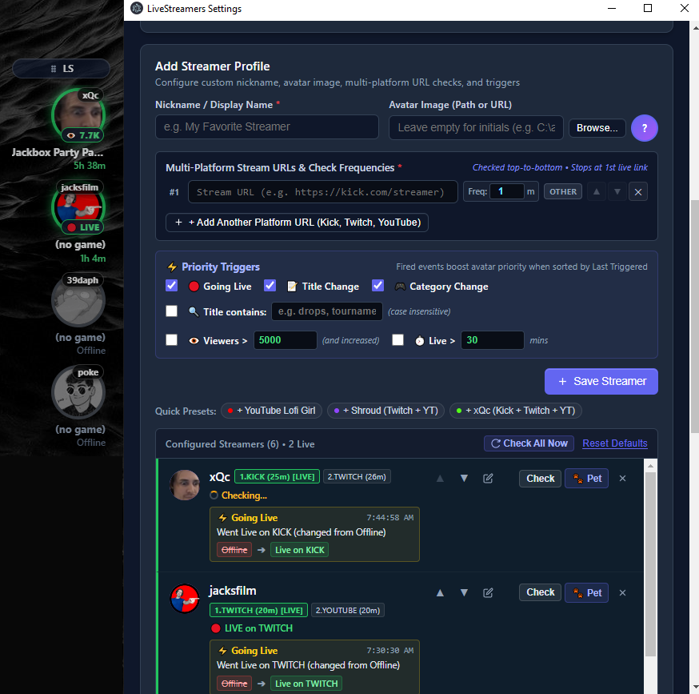

# LiveStreamersCircles

`(Repo and code was created using AI, Gemini 3.6-3.7 Flash, with human oversight on code.)`

A lightweight, transparent desktop overlay built with Electron and native HTML/CSS/JS that tracks live streamers across **Twitch**, **YouTube**, **Kick**, and other platforms in real time. Powered by `yt-dlp` under the hood for metadata extraction and trigger automation.

---

## Screenshot



---

## Tech Stack

- **Runtime**: [Electron](https://www.electronjs.org/) (Node.js 22+ / Bun)
- **Frontend**: Vanilla HTML5, CSS3, JavaScript (Frameless transparent windows with IPC bridge)
- **Crawler / Metadata**: [`yt-dlp`](https://github.com/yt-dlp/yt-dlp) via `yt-dlp-wrap-plus` with automated caching and binary downloading
- **Storage**: JSON-based local persistence (`data/settings.json`, `data/status.json`)


---

## Features

### UI
- **Transparent Circular Avatar Overlay**: Frameless, transparent, always-on-top desktop overlay displaying circular streamer avatars without desktop clutter.
- **Live vs. Offline Visual Distinction**:
  - **Live**: Highlighted with crisp solid borders and customizable colored glow rings.
  - **Offline**: Dimmed opacity and full grayscale filter (`grayscale(100%)`).
  - **Images Avatars**: Allow to put any file or URL
- **Two-Line Streamer Metadata Display**:
  - **Line 1**: Game / Category name (or `(no game)`).
  - **Line 2**: Elapsed live runtime (e.g., `15m`, `2h 15m`) or offline duration (e.g., `3h 40m`, `2d 5h`, or fallback `Offline`), updated dynamically every 30 seconds.
- **Nickname & Viewer Tags**: Optional high-contrast nickname badge on a translucent dark background, alongside real-time live viewer counts.

- **Dedicated Stream Links Popup Window**: choose the link or snooze the stream


### UI "Goodies"
- **Smart Click-Through Mode**: Dynamic cursor tracking that transparently forwards mouse clicks to underlying applications when hovering empty overlay regions, while instantly restoring full interactivity over avatar cards and drag headers.
- **Multiple Saved Window States**: Save and cycle through multiple window positions and dimensions (e.g., State 1 on primary monitor, State 2 compact on secondary display) with a single click on the drag anchor badge (`1/2`, `1/3`).
- **Window Boundary Corner Markers**: Optional visual guide dots at all 4 corners to assist with frameless window edge discovery and precision resizing.
- **Layout Orientations & Reversal**: Toggle between Vertical (`↕`) and Horizontal (`↔`) avatar stacking, with one-click Reverse Order support.
- **Sort**: Sort streamers by many cretiria: `⚡` (Last Triggered), `⏱️` (Longest Live), and `🔤` (A-Z Alphabetical).
- **Rich Hover Tooltips**: Full stream title and context on hover formatted as `${nickname} / ${platform} / ${game} / ${title}`.
- **Low-Resource Compositing**: Zero continuous CSS keyframe animations and removed backdrop blur filters to eliminate GPU compositing overhead.


### Events and Triggers
- **On-Live Script / Batch Command Execution (`actionRules`)**: Automatically run local batch files or shell scripts (e.g., `C:\live.bat %_1`) in the background when assigned streamers go live, with `%_1`, `%1`, or `%_URL%` stream URL substitution.
- **Custom Live Border & Glow Colors (`colorRules`)**: Assign custom hex colors or preset palette tones to streamer groups for distinctive live avatar borders and glowing rings.
- **Priority Triggers Algo**:
  - **Going Live**: Immediate alert trigger when a streamer starts broadcasting.
  - **Stream Title Change**: Triggers on title modifications (with automatic yt-dlp timestamp stripping).
  - **Title / Game Keyword Filter**: Trigger alerts when title or game/category matches comma-separated keywords.
  - **Viewer Count Spike**: Detects when viewer count exceeds a threshold and rises above previous levels.
  - **Category / Game Change**: Triggers when a broadcaster switches categories or games.
  - **Live Runtime Duration**: Triggers after a broadcast reaches a configurable uptime threshold (in minutes).
- **Trigger History & Diff Inspection**: Built-in trigger debug panel showing timestamps and explicit `[from] ➔ [to]` change diff chips.
- **Streamer Snooze Functionality**: Temporarily snooze alerts and sink streamers to the bottom of the list for 1 hour, 8 hours, 1 day, or 7 days, with one-click un-snooze.

### Settings
- **Dedicated Settings GUI**: Full-featured settings dashboard managing streamers, layout, rules, appearance, and crawler behavior.
- **Streamer Profile Management**:
  - Add and edit streamers with custom nicknames, notes, following date, custom avatar images (local file picker or remote URL), and trigger thresholds.
  - Multi-URL streaming links per streamer (Twitch, YouTube, Kick, etc.) with custom priority order and check frequencies.

- **Real-Time Streamer Search & Filter**: Instant filtering across nickname, notes, follow date, platforms, URLs, stream title, and game, with saturated yellow highlight styling (`#ffe600`), `Esc` key reset, and global `Ctrl+F` / `Cmd+F` focus shortcut.
- **Flexible Sorting Strategies**: Sort avatars by Last Triggered, Longest Live, Last Started, Viewer Count (descending), Alphabetical (A-Z), or Manual drag order.
- **Window & System Tray Settings**: Adjust window opacity presets (100%, 75%, 50%, 25%, 10%), toggle Always-on-Top, and access quick actions like "Reset UI" to center windows and recalculate dimensions from tray icon.

### Settings "Goodies"
- **Inactive Offline Streamer Auto-Hiding**: Automatically hide streamers from the desktop overlay if they have been offline longer than a configurable number of days, marked with an `👁️‍🗨️ Hidden in Overlay` badge in the settings list.
- **Popup-Only URL Prefix (`!`)**: Prefix helper links or alternative web players with `!` (e.g., `!https://...`) to skip automated crawler checks while preserving quick-launch access in the links popup.
- **Sequential FIFO Queue & Non-Concurrent yt-dlp Checking**: Queue-based stream verification with an enforced 5-second cooldown between requests and link short-circuiting as soon as a live broadcast is found.
- **Randomized Frequency Staggering**: Automatically staggers new link check intervals between 21–40 minutes (minimum 5 minutes) to avoid crawler rate limits.
- **Live DevTools Streaming**: In-memory 500-entry ring buffer capturing main process and crawler logs, mirrored directly to the Settings DevTools console with a single-line activity monitor.
- **Twitch Lightweight API Fallback**: Built-in native Node `fetch` crawler fallback for Twitch live streams when yt-dlp omits viewer count, game/category, or title.
- **Community Avatar Resources**: One-click external links to browse custom emotes and avatars on 7TV, BetterTTV, and FrankerFaceZ.
- **Visual Snooze Management**: Interactive `💤 Snoozed` status badges in the settings streamer list with click-to-unsnooze.

---


## Getting Started

### 1. Prerequisites
- [Bun](https://bun.sh/) (or Node.js 22+)
- Windows, macOS, or Linux

### 2. Installation
```bash
bun install
```

### 3. Run Development Mode
```bash
bun run start
```

### 4. Build Executables
```bash
# Build for Windows
bun run build:win

# Build for macOS
bun run build:mac

# Build for Linux
bun run build:linux

# Build for all platforms
bun run build:all
```

---

## Project Structure

- [`src/main.js`](src/main.js:1) - Electron main process lifecycle, window state management, and IPC handlers.
- [`src/preload.js`](src/preload.js:1) - Secure context bridge exposing IPC channels to renderer processes.
- [`src/renderer/`](src/renderer/index.html:1) - Transparent circular overlay interface ([`index.html`](src/renderer/index.html:1), [`renderer.js`](src/renderer/renderer.js:1), [`style.css`](src/renderer/style.css:1)).
- [`src/popup/`](src/popup/popup.html:1) - Stream links popup window ([`popup.html`](src/popup/popup.html:1), [`popup.js`](src/popup/popup.js:1), [`popup.css`](src/popup/popup.css:1)).
- [`src/settings/`](src/settings/settings.html:1) - Dedicated settings management dashboard ([`settings.html`](src/settings/settings.html:1), [`settings.js`](src/settings/settings.js:1), [`settings.css`](src/settings/settings.css:1)).
- [`src/tasks/stream-checker.js`](src/tasks/stream-checker.js:1) - FIFO queue live crawler engine and trigger evaluation.
- [`src/tasks/yt-dlp-utils.js`](src/tasks/yt-dlp-utils.js:1) - yt-dlp wrapper, binary caching, and metadata extraction.
- [`src/tasks/storage.js`](src/tasks/storage.js:1) - Persistent configuration and status storage.

---

## License

This project is licensed under the MIT License - see the [`LICENSE`](LICENSE:1) file for details.
